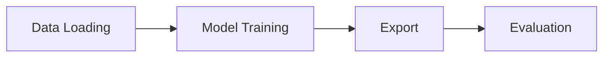

# Project Design Overview

This document summarizes the main components of the repository and how they interact during the training and evaluation workflow.

## Major Modules

### Datasets
- Located under `datasets/`.
- Provide loaders and preprocessing for sources such as MS-COCO, KITTI and Synthetic Shapes.
- Dataset paths and options are configured via `settings.py` and YAML configuration files.

### Models
- Defined under `models/`.
- Include network architectures for SuperPoint and auxiliary components.
- Checkpoints are saved to the `logs/` directory during training.

### Training Scripts
- Scripts such as `Train_model_heatmap.py`, `Train_model_frontend.py` and `Train_model_subpixel.py` run the training loops.
- Configuration files under `configs/` control hyperparameters and dataset options.

### Export
- `export.py` and `export_classical.py` generate keypoints, descriptors and optional segmentation outputs.
- Results are saved under `logs/<export_folder>/predictions` for later evaluation.

### Evaluation
- `evaluation.py` computes metrics like repeatability and homography estimation.
- Visual outputs and scores are stored alongside exported results.

## Workflow
The typical workflow progresses through four main stages:
1. **Data Loading** – datasets are prepared and fed to dataloaders.
2. **Model Training** – training scripts update the model weights and save checkpoints.
3. **Export** – trained models produce predictions on evaluation datasets.
4. **Evaluation** – exported outputs are scored using various metrics.

### Flowchart
```
Data Loading --> Model Training --> Export --> Evaluation
```

### Mermaid Diagram

