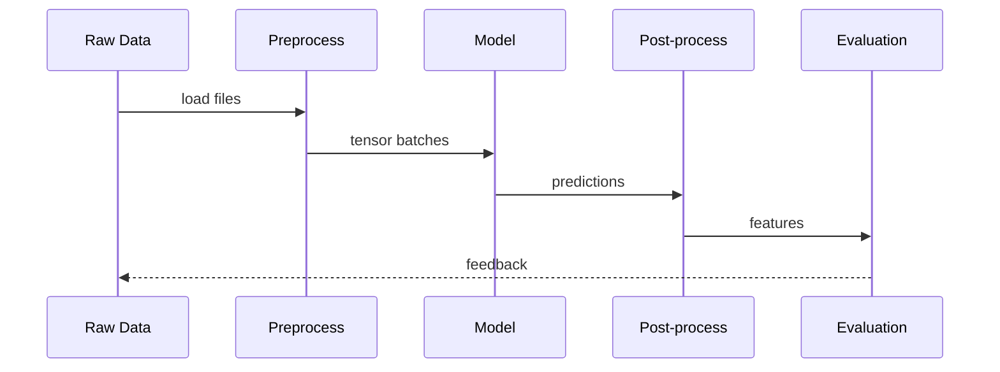

# Pipeline

SuperSegmentaion turns ordinary images into structured feature sets and evaluation reports through a multi-stage pipeline. Understanding that pipeline is essential for extending the system or debugging an experiment. This document follows a batch of samples from raw bytes on disk to the computed metrics that determine success. It complements the high-level descriptions in [Architecture](architecture.md) and the configuration guidelines in [Configurations](configs.md). Together, these resources form a blueprint for navigating the repository. The focus here is on the temporal sequence of events: how data is loaded, transformed, fed through the neural networks, distilled into actionable outputs, and finally scored. Along the way, we will highlight key modules, commonly adjusted parameters, and practical considerations for scaling or customizing the workflow. The goal is to provide a narrative that doubles as a reference: each subsection can be read independently, yet the entire document paints a holistic picture of the end‑to‑end process.

## Raw Data Acquisition

The pipeline begins with raw image collections and optional annotations. Datasets may come from well‑known benchmarks such as HPatches or custom capture sessions. Regardless of origin, files are organized according to conventions expected by the dataset classes in `datasets/`. Images reside under directories that encode split information (train, validation, test) while sidecar metadata defines homographies, labels, or segmentation masks. The configuration files described in [Configurations](configs.md) specify the paths to these resources. During startup, training scripts such as `train4.py` resolve those paths, verify availability, and populate a catalog of sample identifiers. Each identifier includes pointers to image files, labels, and any auxiliary assets required by augmentations. Although this step may seem mundane, careful organization here reduces I/O bottlenecks and ensures reproducibility, especially when experiments are distributed across machines. When using external benchmarks, conversion scripts are sometimes necessary to match the repository’s expected layout. These scripts typically store results as NumPy archives, enabling efficient random access later in the pipeline.

## Preprocessing

Once sample identifiers are available, the heavy lifting of preprocessing begins. DataLoader workers, configured via PyTorch’s `torch.utils.data`, retrieve images and annotations in parallel. Each worker performs a deterministic sequence of transformations defined in dataset classes such as `datasets/augmentations.py`. Common operations include reading the image using OpenCV, converting color spaces, and resizing to canonical dimensions specified in the configuration. Augmentation routines may apply random homographies, perspective jitter, or photometric perturbations. These are implemented with functions from `utils/` (see [Functions](functions.md)) and serve two roles: they increase data diversity and expose the model to realistic variations. The preprocessing stage also generates ancillary structures. For example, when training the subpixel refinement head, the loader produces coarse keypoint grids and ground truth offset maps. All numeric arrays are converted to PyTorch tensors, normalized to the range expected by the networks, and packaged into a dictionary. The dictionary typically contains the following fields:

- `image`: the normalized input tensor.
- `mask`: a binary map indicating valid regions.
- `coord`: keypoint coordinates or segmentation labels, depending on the task.
- `metadata`: camera parameters or file identifiers.

Because preprocessing can dominate runtime, the project leverages caching where appropriate and exposes knobs in the YAML files to toggle expensive augmentations.

## Batching and Queueing

Batched processing enhances throughput by grouping multiple samples before forwarding them to the model. The standard DataLoader assembles mini-batches whose size is controlled by the `batch_size` parameter in the configuration. Each batch is composed by stacking individual tensors along a new dimension, while metadata is collated into lists. Collation logic ensures that variable-sized elements, such as lists of keypoints, are padded or truncated consistently. When training, batches are placed onto a shared queue, allowing the GPU to stay saturated even when CPU-based preprocessing is slow. Advanced users can enable asynchronous prefetching or mixed precision, features that are coordinated through flags in [Settings](settings.md). Importantly, the batching logic also injects seeds into random number generators to guarantee that augmentations are reproducible across epochs. The final product of this stage is a dictionary of batched tensors ready for inference.

## Model Invocation

With preprocessed batches prepared, execution transitions to the model invocation stage. Models defined under `models/` are instantiated according to architectural parameters described in [Architecture](architecture.md). A typical configuration might initialize `SuperPointNet_gauss2` for keypoint detection and dense descriptors, optionally accompanied by `SubpixelNet` for refinement. Checkpoints are loaded to recover learned weights, and the models are moved to the designated device (CPU or GPU). When a batch arrives, the image tensor is forwarded through the network using PyTorch’s autograd mechanism. Internally, the encoder reduces spatial resolution while enriching semantic content; the decoder upsamples these features to produce dense predictions. The forward pass yields a dictionary containing heatmaps (`semi`), descriptor volumes (`desc`), segmentation logits (`segm`), and, if enabled, subpixel offsets (`subpix`). Training scripts compute losses from these outputs using helpers described in [Functions](functions.md), while validation or export scripts skip gradient tracking by wrapping the call in `torch.no_grad()`. Efficient invocation depends on the correct interplay of batch normalization, dropout, and device synchronization. The repository therefore provides utility wrappers that abstract away mixed precision handling, gradient accumulation, and distributed data parallelism.

## Post-processing and Feature Extraction

Raw network outputs are rarely suited for direct consumption. Post-processing modules translate them into compact and meaningful representations. Heatmaps undergo non-maximum suppression to isolate peak responses corresponding to potential keypoints. Thresholding filters out low-confidence detections, and the surviving locations are mapped back to image coordinates using the homography information prepared earlier. Descriptor volumes are normalized along the channel dimension, producing unit vectors that facilitate matching across images. When the subpixel head is active, its offset predictions refine keypoint coordinates beyond the pixel grid, achieving higher localization accuracy. Segmentation logits, if requested, are passed through a softmax to yield class probabilities and then argmaxed to produce hard masks. Post-processing also includes optional steps such as descriptor quantization, feature deduplication across overlapping tiles, or conversion of masks into polygonal outlines. All results are collected into NumPy arrays and serialized into `.npz` files when running export scripts like `export.py`. The design encourages modularity: substituting a different non-maximum suppression strategy or adding a new descriptor normalization technique requires editing only the dedicated post-processing function. For reference, the default implementation resides in `utils/postprocessing.py`.

## Evaluation and Reporting

The culmination of the pipeline is evaluation, where extracted features are assessed against ground truth or benchmark metrics. Evaluation scripts load the `.npz` artifacts and compute statistics defined in [Metrics](metrics.md). For keypoint detection, metrics may include repeatability, localization error, and matching score. Descriptor quality is measured through nearest-neighbor precision or pose estimation success rates, while segmentation masks are evaluated via intersection-over-union and boundary accuracy. Evaluation often proceeds in two passes: a per-image phase that writes intermediate results to disk, followed by an aggregation phase that summarizes performance over a dataset. The repository’s evaluation framework allows custom metrics to be registered through a plugin interface. Logging is integral during this stage. Using utilities described in [Logging](logging.md), scripts emit structured logs that capture configuration hashes, runtime durations, and metric values. These logs can be streamed to the console, stored as JSON, or visualized with TensorBoard. In reproducible experiments, evaluation is performed with the same configuration used during training, ensuring that changes in preprocessing or model architecture are reflected in the reported scores.

## Sequence Diagram

The following sequence diagram illustrates the major stages and the flow of data among them. It is provided as a placeholder; developers may replace it with a concrete diagram tailored to their use case.

## Numbered Flowchart

For a high-level view, the numbered flowchart below lists the pipeline steps in the order they occur. Each step references sections in this document or other guides for deeper detail.

1. **Acquire** raw images and annotations (§ Raw Data Acquisition).
2. **Preprocess** with augmentations and normalization (§ Preprocessing).
3. **Batch** samples and manage queues (§ Batching and Queueing).
4. **Invoke Model** to generate predictions (§ Model Invocation; see [Architecture](architecture.md)).
5. **Post-process** outputs into features (§ Post-processing and Feature Extraction).
6. **Evaluate** against metrics (§ Evaluation and Reporting; see [Metrics](metrics.md)).
7. **Log and Archive** configurations and results (§ Configurations and Logging).

## Configurations and Logging

Configuration management and logging act as connective tissue throughout the pipeline. YAML files described in [Configurations](configs.md) set defaults for dataset paths, augmentation parameters, and model hyperparameters. At runtime, these configurations are loaded and optionally overridden by command-line arguments. The final resolved dictionary is serialized to disk, guaranteeing that the exact settings of an experiment are preserved. Logging utilities, detailed in [Logging](logging.md), record events at each stage. During preprocessing they can warn about missing files; during model invocation they report throughput and loss values; during evaluation they capture metric summaries. The logging system integrates with progress bars, external monitoring services, and experiment tracking dashboards. By coupling configurations and logging, the project achieves transparency: every output can be traced back to inputs, code versions, and runtime environments. This rigor is vital when results are compared across research groups or when a model is promoted to production.

## Key Takeaways

- The pipeline progresses through acquisition, preprocessing, batching, model invocation, post-processing, evaluation, and logging, each stage transforming data in preparation for the next.
- Configurations and modular utilities enable reproducible experiments and facilitate targeted modifications.
- Placeholder diagrams provide starting points for visualizing and communicating the flow to collaborators.

Key Takeaways.
